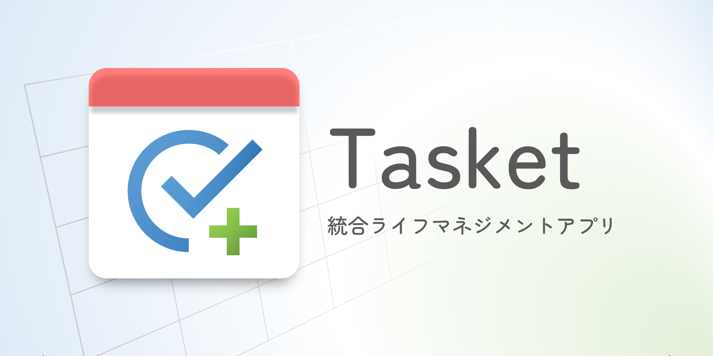

# Tasket



**統合ライフマネジメントアプリ（PWA）**

TODO・家計簿・カレンダー機能を統合したオールインワンの生活管理アプリケーション。

## コンセプト

Tasketは「TODOアイテムに日時や金額を持たせる」というシンプルなアイデアで、タスク管理と家計簿を統一的に扱います。すべてのアイテムがカレンダー上に配置され、予定と実績を一元管理できます。

## 主な機能

### 基本機能

- **TODO管理**: タスクの作成・完了・スケジューリング
- **家計簿**: 収入・支出の記録と管理
- **カレンダー**: すべてのアイテムを時系列で可視化
- **健康管理**: 体重・体脂肪率など健康データの記録と推移の可視化
- **食事ログ**: TODOと統合された食事記録（カロリー、栄養素、写真）
- **PWA対応**: オフライン動作、ホーム画面への追加が可能
- **多言語対応**: 日本語・英語に対応（設定から切り替え可能）

### 拡張機能

- **健康管理機能**: 毎日の健康データを記録・可視化
  - 体重、体脂肪率、BMI、筋肉量、内臓脂肪レベル
  - 血圧、心拍数、体温、血中酸素濃度
  - 歩数、睡眠時間、運動時間、消費カロリー
  - 月次サマリーと先月との比較
  - 健康データ推移グラフ
- **食事ログ機能**: TODO機能と統合された食事記録
  - カロリー、タンパク質、炭水化物、脂質の記録
  - 食事写真のアップロード
  - 日ごと・月ごとの摂取カロリー集計
  - 健康データや家計簿機能との連携
- **日課（ルーティン）管理**: 毎日繰り返し行う習慣やタスクを月ごとに設定・記録
  - 達成状況を3段階で管理（未確認・未達成・達成）
  - 達成グリッドで継続状況を視覚的に確認
- **プリセット機能**: よく使うアイテムをテンプレートとして保存・再利用
- **検索機能**: すべてのアイテムから横断検索
- **データ管理**: JSON形式でのエクスポート・インポート
- **クラウドバックアップ**: S3互換、WebDAV、Dropbox、Azure Blob Storageへのバックアップ・復元
- **サンプルデータ**: 初めてのユーザー向けにデモデータを追加可能
- **チュートリアル**: 初回起動時に自動表示される機能ガイド
  - いつでもメニューから再表示可能
  - 各ビューや主要機能を段階的に説明

### カスタマイズ機能

- **言語設定**: 日本語・英語の切り替え（設定から変更可能）
- **ダークモード**: 目に優しい暗いテーマ（全画面・全コンポーネントで完全対応）
- **背景画像設定**: お好みの画像を背景に設定
- **日付変更線**: 深夜まで作業する方向けの日付区切り設定
- **カレンダー表示設定**: 月ビューの表示項目をカスタマイズ
- **ロック機能**: PINコードでアプリを保護

## 画面構成

### 日ごとのビュー

特定の日のタスクと収支を時系列で管理する詳細ビューです。

**主な要素:**
- **日タイトル**: その日のメインタスクを設定
- **週表示カレンダー**: 前後の日付に素早く移動
- **日課チェックリスト**: 毎日の習慣をチェック
- **日次サマリー**: その日の収支とタスク数を表示
- **健康データサマリー**: その日の体重・体脂肪率・摂取カロリーなどを表示
- **健康データ入力フォーム**: 体重、血圧、歩数などを入力
- **アイテム一覧**: 時刻順にアイテムを管理
- **アイテム追加フォーム**: 新しいアイテムを素早く追加
  - 食事ログ機能: TODOアイテムにカロリーや栄養情報を追加可能

**ユースケース:**
- 今日やることの確認
- 1日の振り返り
- 日々の支出記録
- 体重や血圧などの健康データ記録
- 食事内容とカロリーの記録

### 月ごとのビュー

月全体を俯瞰し、カレンダーと統計情報で予定と実績を把握するビューです。

**主な要素:**

1. **カレンダー表示**
   - 月間カレンダーで各日のアイテム数や金額を表示
   - 日付をクリックすると日ごとのビューに遷移

2. **収支推移グラフ**
   - 折れ線グラフで日ごとの収支の推移を可視化
   - 収入・支出・残高を別々の線で表示

3. **健康データ推移グラフ**
   - 体重・体脂肪率の月間推移を可視化
   - 複数の指標を同時に表示可能

4. **月次サマリー**
   - 月の収入合計・支出合計・収支差額
   - 完了済みタスク数・未完了タスク数

5. **月次健康サマリー**
   - 平均体重・平均体脂肪率
   - 合計歩数・合計運動時間・合計摂取カロリー
   - 先月との比較（体重変化・体脂肪率変化）
   
6. **支出ランキング**
   - 同じ項目名（`title`）で計上された支出を集計
   - 支出額が多い順にランキング表示（0円の項目は除外）
   - 各項目の合計金額と出現回数を表示

7. **日課達成グリッド**
   - その月の日課の達成状況をグリッド形式で表示
   - 継続状況を一目で把握

**ユースケース:**
- 月の予算管理
- 支出パターンの分析
- よく使う項目の把握
- 習慣の継続確認
- 健康状態の月間推移確認
- 食事・運動・体重の相関分析

## データ構造

### IndexedDB テーブル

#### `items` - アイテム（TODO・収入・支出）

すべてのアイテム（TODO・収入・支出）を統一的に管理します。

| フィールド | 型 | 説明 |
|-----------|-----|------|
| `id` | string (UUID) | アイテムの一意識別子 |
| `title` | string | タスク名または項目名 |
| `amount` | number | 金額（JPY）。TODOの場合は0 |
| `type` | 'todo' \| 'expense' \| 'income' | アイテムの種別 |
| `is_completed` | boolean | 完了状態（TODOの完了、収支の確定） |
| `scheduled_at` | Date | 予定日時（カレンダーの配置場所） |
| `executed_at` | Date \| null | 実行日時（実際の完了日・取引日） |
| `created_at` | Date | 作成日時 |
| `notes` | string | 備考 |
| `mealLog` | object \| null | 食事ログデータ（TODOの場合のみ） |

**食事ログデータの構造:**

| フィールド | 型 | 説明 |
|-----------|-----|------|
| `calories` | number | カロリー（kcal） |
| `protein` | number | タンパク質（g） |
| `carbs` | number | 炭水化物（g） |
| `fat` | number | 脂質（g） |
| `photo` | string | 写真（Base64エンコード） |
| `memo` | string | 自由メモ |

#### `healthData` - 健康データ

日ごとの健康状態を記録します。

| フィールド | 型 | 説明 |
|-----------|-----|------|
| `id` | string (UUID) | 一意のID |
| `date` | string | 記録日（YYYY-MM-DD形式） |
| `weight` | number | 体重（kg） |
| `bodyFatPercentage` | number | 体脂肪率（%） |
| `muscleMass` | number | 筋肉量（kg） |
| `visceralFatLevel` | number | 内臓脂肪レベル |
| `basalMetabolicRate` | number | 基礎代謝量（kcal） |
| `systolicBloodPressure` | number | 最高血圧（mmHg） |
| `diastolicBloodPressure` | number | 最低血圧（mmHg） |
| `heartRate` | number | 心拍数（bpm） |
| `bodyTemperature` | number | 体温（℃） |
| `spo2` | number | 血中酸素濃度（%） |
| `sleepHours` | number | 睡眠時間（時間） |
| `steps` | number | 歩数 |
| `exerciseMinutes` | number | 運動時間（分） |
| `caloriesBurned` | number | 消費カロリー（kcal） |
| `waterIntake` | number | 水分摂取量（ml） |
| `menstrualCycle` | string \| null | 生理周期 |
| `medicationRecord` | string | 服薬記録 |
| `healthMemo` | string | 体調メモ |
| `created_at` | Date | 作成日時 |
| `updated_at` | Date | 更新日時 |

#### `dayTitles` - 日タイトル

各日に設定できる「今日やること」の見出し。

| フィールド | 型 | 説明 |
|-----------|-----|------|
| `id` | string (UUID) | 一意のID |
| `date` | string | 対象日（YYYY-MM-DD形式） |
| `title` | string | タイトル |
| `created_at` | Date | 作成日時 |

#### `routines` - 日課

月ごとに設定する毎日繰り返し行う習慣やタスクの定義。

| フィールド | 型 | 説明 |
|-----------|-----|------|
| `id` | string (UUID) | 一意のID |
| `yearMonth` | string | 対象年月（YYYY-MM形式） |
| `title` | string | 日課のタイトル |
| `order` | number | 表示順序 |
| `created_at` | Date | 作成日時 |

#### `routineLogs` - 日課ログ

日課の達成記録。

| フィールド | 型 | 説明 |
|-----------|-----|------|
| `id` | string (UUID) | 一意のID |
| `routineId` | string | 対象の日課ID |
| `date` | string | 記録日（YYYY-MM-DD形式） |
| `status` | 'unconfirmed' \| 'not_achieved' \| 'achieved' | ステータス |
| `completed_at` | Date \| null | 完了日時（達成時のみ） |

#### `presets` - プリセット

よく使うアイテムのテンプレート。

| フィールド | 型 | 説明 |
|-----------|-----|------|
| `id` | string (UUID) | 一意のID |
| `title` | string | プリセット名（アイテム名） |
| `time` | string | 時刻（HH:mm形式） |
| `type` | 'todo' \| 'expense' \| 'income' | アイテムの種別 |
| `amount` | number | 金額 |
| `notes` | string | 備考 |
| `created_at` | Date | 作成日時 |

#### `appSettings` - アプリ設定

チュートリアル状態、ロック設定、表示設定などのアプリケーション設定。

| フィールド | 型 | 説明 |
|-----------|-----|------|
| `id` | string | 設定ID（固定値 'app-settings'） |
| `hasSeenTutorial` | boolean | チュートリアル表示済みフラグ |
| `lockEnabled` | boolean | ロック機能の有効/無効 |
| `pinHash` | string \| null | PINコードのハッシュ値 |
| `biometricEnabled` | boolean | 生体認証の有効/無効 |
| `biometricCredentialId` | string \| null | 生体認証のクレデンシャルID |
| `maxAttempts` | number | 最大試行回数 |
| `lockTimeout` | number | ロック解除後の再ロックタイムアウト（ミリ秒） |
| `darkMode` | boolean | ダークモードの有効/無効 |
| `language` | 'ja' \| 'en' | 表示言語（日本語/英語） |
| `backgroundImage` | string | 背景画像のパス |
| `dateChangeLine` | number | 日付変更線の時刻（0-23時） |
| `calendarDisplay` | object | カレンダー表示設定 |
| `updated_at` | Date | 更新日時 |

#### `cloudBackupConfigs` - クラウドバックアップ設定

クラウドストレージへのバックアップ設定を管理します。

| フィールド | 型 | 説明 |
|-----------|-----|------|
| `id` | string (UUID) | 設定ID |
| `provider` | string | プロバイダー種別（s3-compatible, webdav, dropbox, azure-blob） |
| `name` | string | 設定名 |
| `endpoint` | string | エンドポイントURL |
| `region` | string | リージョン（S3互換のみ） |
| `bucket` | string | バケット名/コンテナ名 |
| `accessKeyId` | string | アクセスキー（暗号化済み） |
| `secretAccessKey` | string | シークレットキー（暗号化済み） |
| `isEnabled` | boolean | 有効/無効 |
| `autoBackup` | boolean | 自動バックアップの有効/無効 |
| `autoBackupInterval` | number | 自動バックアップ間隔（時間） |
| `created_at` | Date | 作成日時 |
| `updated_at` | Date | 更新日時 |
| `last_backup_at` | Date | 最終バックアップ日時 |

#### `backupHistory` - バックアップ履歴

クラウドバックアップの実行履歴を記録します。

| フィールド | 型 | 説明 |
|-----------|-----|------|
| `id` | string (UUID) | 履歴ID |
| `configId` | string | 使用した設定のID |
| `status` | string | ステータス（success, failed, in-progress） |
| `type` | string | バックアップ種別（manual, auto） |
| `size` | number | バックアップサイズ（バイト） |
| `itemCount` | number | アイテム数 |
| `error` | string | エラーメッセージ（失敗時） |
| `remotePath` | string | リモートパス |
| `created_at` | Date | 実行日時 |

### データモデルの特徴

- **統一モデル**: TODO・収入・支出すべてを同じテーブルで管理
- **予定と実績の分離**: `scheduled_at`（予定）と`executed_at`（実績）を別々に記録
- **柔軟な分類**: `type`フィールドで用途を区別
- **完了管理**: `is_completed`でタスク完了や取引確定を管理
- **IndexedDBで永続化**: すべての設定とデータをブラウザ内のIndexedDBで管理
- **データ移行対応**: エクスポート/インポートで設定も含めて引き継ぎ可能

## ユースケース例

### TODOとして使う
```javascript
{
  title: "プロジェクト資料作成",
  type: "todo",
  amount: 0,
  scheduled_at: "2025-12-05T14:00:00",
  is_completed: false
}
```

### 支出として使う
```javascript
{
  title: "昼食代",
  type: "expense",
  amount: 1200,
  scheduled_at: "2025-12-02T12:00:00",
  executed_at: "2025-12-02T12:30:00",
  is_completed: true
}
```

### 収入として使う
```javascript
{
  title: "給料",
  type: "income",
  amount: 300000,
  scheduled_at: "2025-12-25T00:00:00",
  is_completed: false
}
```

## クラウドバックアップ機能

Tasketは、複数のクラウドストレージプロバイダーへのデータバックアップ・復元をサポートしています。

### サポートプロバイダー

#### 1. S3互換ストレージ
- AWS S3
- MinIO
- Wasabi
- Cloudflare R2
- その他のS3互換ストレージ

#### 2. WebDAV
- Nextcloud
- ownCloud
- Box
- その他のWebDAV対応ストレージ

#### 3. Dropbox
- Dropbox API v2を使用

#### 4. Azure Blob Storage
- Azure Blob Storage REST API

### 主な機能

- **暗号化**: 認証情報はAES-GCM暗号化してIndexedDBに保存
- **手動バックアップ**: ワンクリックでクラウドにデータをアップロード
- **自動バックアップ**: 設定した間隔で自動的にバックアップを実行
- **復元**: クラウドからバックアップデータを選択して復元
- **履歴管理**: バックアップの成功・失敗を履歴として記録
- **複数設定**: 複数のクラウドプロバイダーを登録可能
- **接続テスト**: 設定保存前に接続を確認

### セットアップ方法

各プロバイダーのセットアップ方法は、アプリ内の「セットアップマニュアルを表示」ボタンから詳細なガイドを確認できます。

### セキュリティ

- 認証情報（アクセスキー、シークレットキー、トークン）はWeb Crypto APIを使用してAES-GCM暗号化
- 暗号化キーはlocalStorageに保存（デバイス固有）
- HTTPS接続を前提とした設計
- CORS設定に関する詳細なガイドを提供

## 技術スタック

- **フレームワーク**: Nuxt 4
- **データベース**: IndexedDB（ブラウザローカル）
- **PWA**: Service Worker、Manifest
- **UI**: Vue 3 Composition API
- **多言語化**: @nuxtjs/i18n (日本語キー、フォールバック対応)

## セットアップ

依存関係のインストール:

```bash
npm install
```

## 開発サーバー

開発サーバーを `http://localhost:3000` で起動:

```bash
npm run dev
```

## プロダクションビルド

本番用にアプリケーションをビルド:

```bash
npm run build
```

ビルドしたアプリケーションをローカルでプレビュー:

```bash
npm run preview
```

## OSSライセンス表記

本プロジェクトでは、使用しているOSSモジュールのライセンス情報を明示的に管理しています。

### ライセンスファイルの生成

ビルド時に、依存しているすべてのOSSモジュールのライセンス情報が自動的に `public/licenses.txt` および `.output/public/licenses.txt` に出力されます。このファイルには以下の情報が含まれます：

- パッケージ名とバージョン
- ライセンスタイプ
- ライセンス全文

### 実装詳細

Viteの `rollup-plugin-license` プラグインを使用してライセンス情報を抽出しています。設定は `nuxt.config.ts` で行っています。

## ライセンス

MIT
